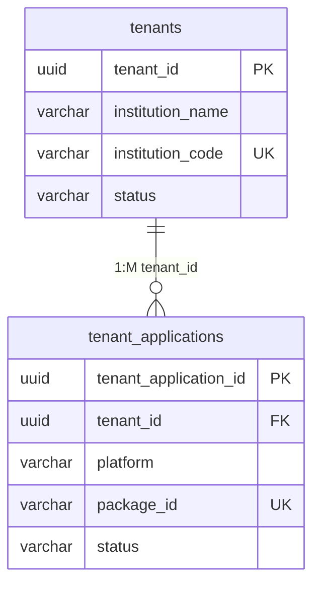
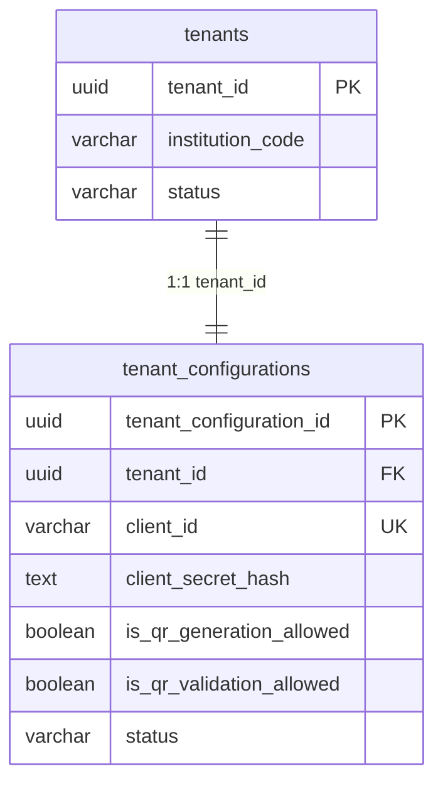
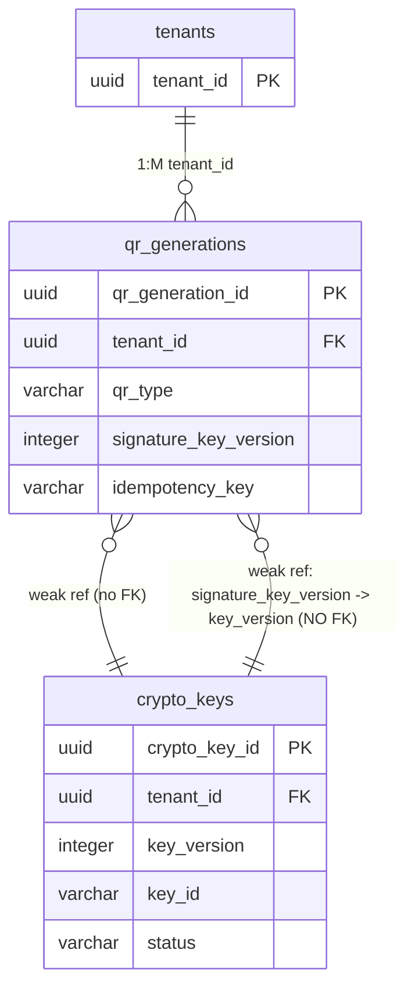
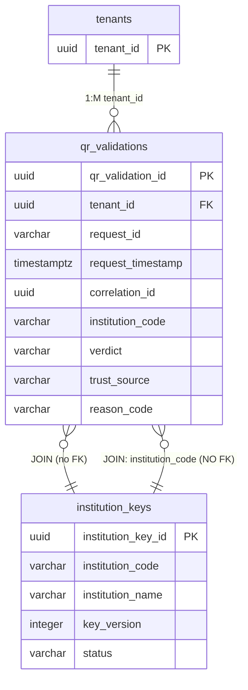
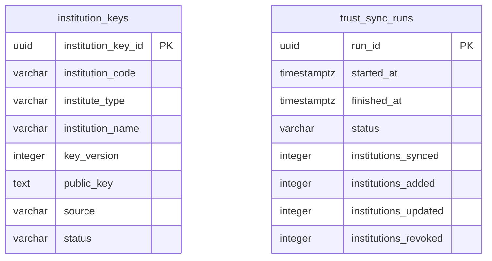
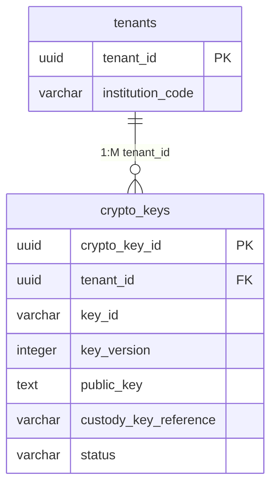
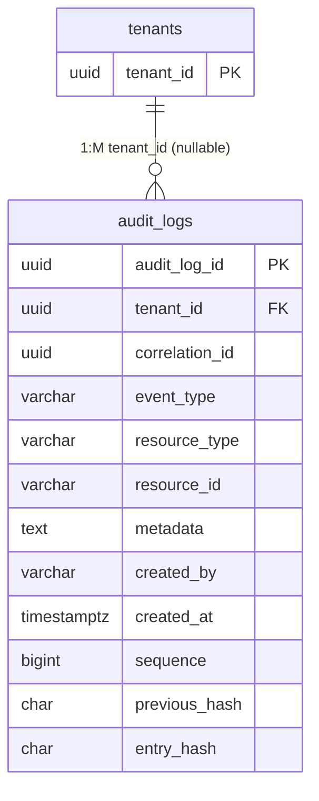

# SBQR Database Design

**Source of truth:** `db/migrations/*.sql` (applied by the external migration tool).
**EF Core model:** the `IEntityTypeConfiguration<T>` classes that map each table.
**Spec reference:** `docs/bb-banglaqr-p2p-specification.md` - Chapter 2 + Annexes A-E.

This document is the single canonical reference for the `sbqr_app` PostgreSQL
schema: every table, column, index, constraint, relationship, and the EF Core
mapping that backs it. The schema-drift integration tests
(`SchemaModelDriftTests.cs`) enforce that the SQL migrations and the EF Core
models never diverge.

> **Persistence model (C20):** the runtime DB user has **no DDL**. Migrations are
> applied out-of-band by an owner/admin role via the external tool; the
> `SBQR.Api` host **never** calls `DbContext.Database.Migrate()`. EF Core
> `DbContext` instances exist only for CRUD; the SQL scripts own the schema.

---

## 1. Databases and schemas

| Logical database | Purpose | Owner |
|---|---|---|
| `sbqr_app` | All public-side application state | `sbqr_app_owner` |
| `sbqr_key_vault` | Wrapped (encrypted) private-key material only | `sbqr_key_vault` (separate host in production) |

**Schema layout:** single `public` schema. There are **no** per-module schemas -
every table lives in `public`. (Migration `001_module_schemas.sql` created the
schema and records this decision.)

The `sbqr_key_vault` database has **no migration script yet** - it is provisioned
by the KeyCustody vault providers (`S3SigningKeyStore`,
`EncryptedFileSigningKeyStore`) at runtime. See AGENTS.md for the Ed25519
key-generation commands.

### Connection strings

Configured in `docker-compose.yml` and production environment variables:

```
ConnectionStrings__sbqr_app           -> sbqr_app database
ConnectionStrings__sbqr_key_vault     -> sbqr_key_vault database
```

### Cross-module FK pattern

Every hard foreign key in the schema points to `tenants` (the tenant aggregate
root). All are `ON DELETE RESTRICT`. The table below summarizes the pattern -
full per-module relationship diagrams appear in each module section below.

| Child table | Module | FK column | Parent | Notes |
|---|---|---|---|---|
| `tenant_applications` | Tenancy | `tenant_id` | `tenants` | Same BC |
| `tenant_configurations` | IdentityAccess | `tenant_id` | `tenants` | Cross-BC |
| `qr_generations` | QrGeneration | `tenant_id` | `tenants` | Cross-BC; weak ref to `crypto_keys` |
| `qr_validations` | Verification | `tenant_id` | `tenants` | Cross-BC; JOIN to `institution_keys` |
| `crypto_keys` | KeyCustody | `tenant_id` | `tenants` | Cross-BC |
| `audit_logs` | Audit | `tenant_id` | `tenants` | Cross-BC; tenant_id is **nullable** (NULL = platform-level) |

**Weak / cross-module references** (no FK - by design):

| Referencing | Column | Referenced | Notes |
|---|---|---|---|
| `qr_generations` | `signature_key_version` | `crypto_keys.key_version` | Module boundary; enables post-rotation key lookup |
| `institution_keys` | `institution_code` | `tenants.institution_code` | JOIN at query time; institution_keys is shared (platform table) |
| `qr_validations` | `institution_code` | `institution_keys.institution_code` | JOIN at query time; verification resolves trust key |

---

## 2. Module: Tenancy

**Purpose:** Tenant lifecycle management - onboarding, status transitions
(`PENDING` -> `ACTIVE` -> `SUSPENDED` -> `TERMINATED`), and the per-tenant
mobile-app allow-list consulted at OAuth token-mint time.

**Tables:** `tenants`, `tenant_applications`  
**EF context:** `TenancyDbContext` (`SBQR.Modules.Tenancy.Infrastructure`)  
**Migrations:** `002_tenancy.sql`, `008_tenant_applications.sql`

### Relationships

- `tenants` 1:M `tenant_applications` (FK `tenant_applications.tenant_id` -> `tenants.tenant_id`, `ON DELETE RESTRICT`)



### 2.1 `public.tenants`

**Aggregate root:** `Tenant` (`SBQR.Modules.Tenancy.Domain.Aggregates`).
**EF config:** `TenantConfiguration.cs`.

**Status vocabulary:** `PENDING` | `ACTIVE` | `SUSPENDED` | `TERMINATED`.

| Column | Type | Nullable | Default | Description |
|---|---|---|---|---|
| `tenant_id` | `uuid` | NOT NULL | -- | Primary key. Server-assigned UUID v7 (`Guid.CreateVersion7()` in `Tenant.Register`). |
| `institution_name` | `varchar(200)` | NOT NULL | -- | Human-readable institution name. |
| `institution_code` | `varchar(6)` | NOT NULL | -- | Six-digit BB-assigned code. UNIQUE. Mirrors `institution_keys.institution_code`. |
| `status` | `varchar(20)` | NOT NULL | -- | `PENDING` / `ACTIVE` / `SUSPENDED` / `TERMINATED`. |
| `is_active` | `boolean` | NOT NULL | `true` | Soft-delete flag. |
| `created_by` | `varchar(200)` | NULL | -- | Audit - stamped by `TenancyAuditColumnInterceptor`. |
| `created_at` | `timestamptz` | NOT NULL | `now()` | Audit. |
| `modified_by` | `varchar(200)` | NULL | -- | Audit - stamped by `TenancyAuditColumnInterceptor` on update. |
| `modified_at` | `timestamptz` | NULL | -- | Audit. |

**CHECK constraints:** _none_ - status vocabulary is enforced by the domain
aggregate (`TenantStatus` enum) and the EF value converter.

**Indexes:**

| Name | Type | Columns | Filter | Purpose |
|---|---|---|---|---|
| `pk_tenants` | PK | `tenant_id` | -- | Primary key. |
| `ix_tenants_institution_code` | UNIQUE | `institution_code` | -- | C5 join key; natural unique key. |
| `ix_tenants_status` | btree | `status` | -- | Status lookups (activation gates, dashboards). |
| `ix_tenants_active` | btree | `is_active` | `is_active = TRUE` | Active-tenant hot path (excludes soft-deleted). |

> The `TenantId` record struct (`readonly record struct(Guid Value)`) is
> converted to/from `uuid` via `HasConversion` in `TenantConfiguration.cs`.

---

### 2.2 `public.tenant_applications`

**Aggregate root:** `TenantApplication` (`SBQR.Modules.Tenancy.Domain.Aggregates`).
**EF config:** `TenantApplicationConfiguration.cs`.

One row per registered mobile-app package identifier for a tenant. Consulted by
the IdentityAccess token endpoint at mint time via the
`ITenantApplicationDirectory` seam (FR-AUTH-002).

**Status vocabulary:** `ACTIVE` | `SUSPENDED`.  
**Platform vocabulary:** `ANDROID` | `IOS`.

| Column | Type | Nullable | Default | Description |
|---|---|---|---|---|
| `tenant_application_id` | `uuid` | NOT NULL | -- | Primary key. |
| `tenant_id` | `uuid` | NOT NULL | -- | FK -> `tenants.tenant_id` (`ON DELETE RESTRICT`). |
| `platform` | `varchar(10)` | NOT NULL | -- | `ANDROID` / `IOS`. |
| `package_id` | `varchar(200)` | NOT NULL | -- | Android `applicationId` or iOS bundle ID. |
| `status` | `varchar(20)` | NOT NULL | `'ACTIVE'` | `ACTIVE` / `SUSPENDED`. |
| `is_active` | `boolean` | NOT NULL | `true` | Soft-delete flag. |
| `created_by` | `varchar(200)` | NULL | -- | Audit. |
| `created_at` | `timestamptz` | NOT NULL | `now()` | Audit. |
| `modified_by` | `varchar(200)` | NULL | -- | Audit. |
| `modified_at` | `timestamptz` | NULL | -- | Audit. |

**CHECK constraints:**

| Name | Expression |
|---|---|
| `ck_tenant_applications_platform` | `platform IN ('ANDROID','IOS')` |
| `ck_tenant_applications_status` | `status IN ('ACTIVE','SUSPENDED')` |

> Per `TenantApplicationConfiguration.cs`, CHECK constraints are declared by the
> SQL migration only - the EF drift test deliberately skips CHECK comparison
> (EF Core 10's `ICheckConstraint` API is unstable across patch releases).

**Indexes:**

| Name | Type | Columns | Filter | Purpose |
|---|---|---|---|---|
| `pk_tenant_applications` | PK | `tenant_application_id` | -- | Primary key. |
| `ix_tenant_applications_platform_package_id` | UNIQUE | `platform, package_id` | -- | FR-AUTH-002 duplicate-application guard (same package_id legal on both platforms). |
| `ix_tenant_applications_tenant` | btree | `tenant_id` | -- | FK support (Postgres does not auto-index FK columns). |
| `ix_tenant_applications_active` | btree | `is_active` | `is_active = TRUE` | Auth hot path. |
| `ix_tenant_applications_tenant_platform_package` | btree | `tenant_id, platform, package_id, is_active` | `is_active = TRUE` | FR-AUTH-003 attestation golden-record lookup. |

---

## 3. Module: IdentityAccess

**Purpose:** OAuth 2.1 client credentials for tenants. Per-tenant
`client_id` / `client_secret_hash` pairs with QR capability flags, used to
gate API access to the QR generation and verification endpoints.

**Tables:** `tenant_configurations`  
**EF context:** `IdentityDbContext` (`SBQR.Modules.IdentityAccess.Infrastructure`)  
**EF config:** `TenantConfigurationConfiguration.cs`  
**Migration:** `002_tenancy.sql`

### Relationships

- `tenants` 1:1 `tenant_configurations` (FK `tenant_configurations.tenant_id` -> `tenants.tenant_id`, `ON DELETE RESTRICT`)



### 3.1 `public.tenant_configurations`

Per-tenant OAuth 2.1 client-credential pair (Argon2id-hashed) plus capability
flags gating the QR generation and verification flows. Physically lives in
`public` (relocated from the legacy `identity` schema on 2026-09-09). BC owner
is **IdentityAccess** - Tenancy only reads `tenant_id` for FK support.

**Status vocabulary:** `ACTIVE` | `SUSPENDED` | `REVOKED` | `EXPIRED` | `PENDING_ROTATION`.

| Column | Type | Nullable | Default | Description |
|---|---|---|---|---|
| `tenant_configuration_id` | `uuid` | NOT NULL | -- | Primary key. |
| `tenant_id` | `uuid` | NOT NULL | -- | FK -> `tenants.tenant_id` (`ON DELETE RESTRICT`). Opaque Guid across the Tenancy boundary. |
| `client_id` | `varchar(100)` | NOT NULL | -- | `{institution_code-lowercase}-{8-hex}` (e.g. `mtb-7c1b4d88`). UNIQUE. |
| `client_secret_hash` | `text` | NOT NULL | -- | Argon2id PHC-format string (`$argon2id$...`). Plaintext never stored. |
| `is_qr_generation_allowed` | `boolean` | NOT NULL | `true` | QR generation capability gate. |
| `is_qr_validation_allowed` | `boolean` | NOT NULL | `true` | QR verification capability gate. |
| `status` | `varchar(20)` | NOT NULL | `'ACTIVE'` | `ACTIVE` / `SUSPENDED` / `REVOKED` / `EXPIRED` / `PENDING_ROTATION`. |
| `expires_at` | `timestamptz` | NULL | -- | Credential expiry (null = open-ended). |
| `last_used_at` | `timestamptz` | NULL | -- | Last successful token mint. |
| `created_by` | `varchar(200)` | NULL | -- | Audit. |
| `created_at` | `timestamptz` | NOT NULL | `now()` | Audit. |
| `modified_by` | `varchar(200)` | NULL | -- | Audit. |
| `modified_at` | `timestamptz` | NULL | -- | Audit. |
| `is_active` | `boolean` | NOT NULL | `true` | Soft-delete flag. |

**CHECK constraints:**

| Name | Expression |
|---|---|
| `ck_tenant_configurations_status` | `status IN ('ACTIVE','SUSPENDED','REVOKED','EXPIRED','PENDING_ROTATION')` |

> Note: the EF config (`TenantConfigurationConfiguration.cs`, line 53) references
> a DB CHECK constraint `chk_tenant_configurations_client_secret_hash_argon2id`
> (defined in a future migration `20260911120000_*`) that has **not yet been
> applied** - the current SQL migration (`002`) does **not** declare a CHECK on
> `client_secret_hash`. The domain-level `Argon2idFormat` regex in
> `TenantConfiguration.Register` is the current enforcement point.

**Indexes:**

| Name | Type | Columns | Filter | Purpose |
|---|---|---|---|---|
| `pk_tenant_configurations` | PK | `tenant_configuration_id` | -- | Primary key. |
| `ix_tenant_configurations_client_id_unique` | UNIQUE | `client_id` | -- | OAuth token-endpoint hot path (`client_id -> tenant + flags`). |
| `ix_tenant_configurations_tenant` | btree | `tenant_id` | -- | FK support. |
| `ix_tenant_configurations_status` | btree | `status` | -- | Status lookups (rotation, revocation). |
| `ix_tenant_configurations_expires_at` | btree | `expires_at` | `expires_at IS NOT NULL` | Expiry sweeps. |
| `ix_tenant_configurations_active` | btree | `is_active` | `is_active = TRUE` | Active-credential hot path. |

---

## 4. Module: QrGeneration

**Purpose:** QR code issuance. Append-only record of each generated BanglaQR P2P
code, with idempotency (A9) and signing-key version tracking.

**Tables:** `qr_generations`  
**EF context:** `QrGenerationDbContext` (`SBQR.Modules.QrGeneration.Infrastructure`)  
**EF config:** inline in `QrGenerationDbContext.cs` (no separate config class)  
**Migration:** `003_generation.sql`

### Relationships

- `tenants` 1:M `qr_generations` (FK `qr_generations.tenant_id` -> `tenants.tenant_id`, `ON DELETE RESTRICT`)
- `crypto_keys` ~M:1 `qr_generations` (WEAK reference - no FK, `qr_generations.signature_key_version` -> `crypto_keys.key_version`, cross-module to KeyCustody)



### 4.1 `public.qr_generations`

**Append-only** - no `modified_*` / `is_active` columns. A generation is an
immutable financial event. The QR payload and its hash are **not** persisted
(integrity rests on the Ed25519 signature + CRC; see AGENTS.md section 2).

**QR type vocabulary:** `STATIC` | `DYNAMIC` (spec section 2.2: `01(O: 11=static, 12=dynamic)`).

| Column | Type | Nullable | Default | Description |
|---|---|---|---|---|
| `qr_generation_id` | `uuid` | NOT NULL | -- | Primary key. |
| `tenant_id` | `uuid` | NOT NULL | -- | FK -> `tenants.tenant_id` (`ON DELETE RESTRICT`). |
| `qr_type` | `varchar(10)` | NOT NULL | -- | `STATIC` / `DYNAMIC`. |
| `signature_key_version` | `integer` | NOT NULL | -- | Version of the tenant signing key (`crypto_keys.key_version`) that signed this QR. Weak reference - no FK (module boundary). |
| `idempotency_key` | `varchar(100)` | NULL | -- | Client-supplied `Idempotency-Key` (optional in API). Tenant-scoped uniqueness when present (A9). |
| `created_by` | `varchar(200)` | NULL | -- | Audit - stamped by `QrGenerationAuditColumnInterceptor`. |
| `created_at` | `timestamptz` | NOT NULL | `now()` | Audit. |

**CHECK constraints:**

| Name | Expression |
|---|---|
| `ck_qr_generations_qr_type` | `qr_type IN ('STATIC','DYNAMIC')` |

**Indexes:**

| Name | Type | Columns | Filter | Purpose |
|---|---|---|---|---|
| `pk_qr_generations` | PK | `qr_generation_id` | -- | Primary key. |
| `uq_qr_generations_tenant_idempotency` | UNIQUE | `tenant_id, idempotency_key` | `idempotency_key IS NOT NULL` | A9 idempotency gate - DB-enforced, closes the concurrent-retry race. PG 23505 -> 409 `DUPLICATE_IDEMPOTENCY_KEY`. |
| `ix_qr_generations_tenant_created` | btree | `tenant_id, created_at DESC` | -- | Tenant dashboards / monitoring pagination. |
| `ix_qr_generations_tenant_key_version` | btree | `tenant_id, signature_key_version` | -- | Blast-radius query: "every code signed with key version N of tenant T". |

---

## 5. Module: Verification

**Purpose:** QR code verification. Persists every verification attempt with its
verdict (signature valid, structural invalid, key not found/revoked, replay,
etc.). Implements the spec Annex B verification pipeline: parse TLV -> validate
CRC -> resolve issuer key -> Ed25519 verify -> route by MCC (Tag 52).

**Tables:** `qr_validations`  
**EF context:** `VerificationDbContext` (`SBQR.Modules.Verification.Infrastructure`)  
**EF config:** inline in `VerificationDbContext.cs`  
**Migration:** `004_verification.sql`

### Relationships

- `tenants` 1:M `qr_validations` (FK `qr_validations.tenant_id` -> `tenants.tenant_id`, `ON DELETE RESTRICT`)
- `institution_keys` ~M:1 `qr_validations` (JOIN only - no FK, `qr_validations.institution_code` -> `institution_keys.institution_code`, cross-module to InstitutionTrust)



### 5.1 `public.qr_validations`

One row per processed verification request - **both** request context (C5/C6)
and outcome are persisted in a single `SaveChanges`. This replaced the former
`qr_transactions` table (removed 2026-09-08).

**Verdict vocabulary:** `VALID` | `INVALID_SIGNATURE` | `STRUCTURAL_INVALID` |
`KEY_NOT_FOUND` | `KEY_SUSPENDED` | `KEY_REVOKED` | `KEY_NOT_ACTIVE` |
`NON_P2P` | `REQUEST_STALE` | `REQUEST_REPLAYED`.

**Trust source vocabulary:** `TRUST_DIRECTORY` | `NONE` (OWN_CUSTODY removed).

| Column | Type | Nullable | Default | Description |
|---|---|---|---|---|
| `qr_validation_id` | `uuid` | NOT NULL | -- | Primary key. |
| `tenant_id` | `uuid` | NOT NULL | -- | C5: the **verifying** tenant (resolved server-side via `ICurrentTenant`). FK -> `tenants.tenant_id` (`ON DELETE RESTRICT`). |
| `request_id` | `varchar(100)` | NOT NULL | -- | C6: client-generated unique id per verification call. |
| `request_timestamp` | `timestamptz` | NOT NULL | -- | C6: client clock at send time. Handler validates +/- 5 min window. |
| `correlation_id` | `uuid` | NOT NULL | -- | A5: server-generated per request. Embedded in audit metadata for join. |
| `institution_code` | `varchar(6)` | NULL | -- | Issuer code extracted from the QR payload. NULL when too malformed to carry one. |
| `verdict` | `varchar(30)` | NOT NULL | -- | Outcome. See verdict vocabulary below. |
| `trust_source` | `varchar(20)` | NOT NULL | `'NONE'` | `TRUST_DIRECTORY` / `NONE`. |
| `reason_code` | `varchar(60)` | NULL | -- | A11: machine-readable rejection code (mandatory when verdict is not `VALID`/`NON_P2P`). |
| `created_by` | `varchar(200)` | NULL | -- | Audit. |
| `created_at` | `timestamptz` | NOT NULL | `now()` | Audit. |

**Verdict vocabulary** (`ck_qr_validations_verdict`):

| Value | Meaning |
|---|---|
| `VALID` | Signature verified successfully. |
| `INVALID_SIGNATURE` | Ed25519 verification failed. |
| `STRUCTURAL_INVALID` | CRC or TLV structure failure. |
| `KEY_NOT_FOUND` | Issuer not in trust store. |
| `KEY_SUSPENDED` | Issuer key status = SUSPENDED - fail closed. |
| `KEY_REVOKED` | Issuer key status = REVOKED - fail closed. |
| `KEY_NOT_ACTIVE` | Issuer key status not ACTIVE (and not RETIRED fallback). |
| `NON_P2P` | MCC (Tag 52) != 4829 - not a P2P transaction. Informational. |
| `REQUEST_STALE` | `request_timestamp` outside +/- 5 min window. |
| `REQUEST_REPLAYED` | Duplicate `(tenant_id, request_id)` - C6 replay guard. |

**CHECK constraints:**

| Name | Expression |
|---|---|
| `ck_qr_validations_verdict` | `verdict IN ('VALID','INVALID_SIGNATURE','STRUCTURAL_INVALID','KEY_NOT_FOUND','KEY_SUSPENDED','KEY_REVOKED','KEY_NOT_ACTIVE','NON_P2P','REQUEST_STALE','REQUEST_REPLAYED')` |
| `ck_qr_validations_trust_source` | `trust_source IN ('TRUST_DIRECTORY','NONE')` |
| `ck_qr_validations_reason_required` | `verdict IN ('VALID','NON_P2P') OR reason_code IS NOT NULL` |

**Indexes:**

| Name | Type | Columns | Filter | Purpose |
|---|---|---|---|---|
| `pk_qr_validations` | PK | `qr_validation_id` | -- | Primary key. |
| `uq_qr_validations_replay` | UNIQUE | `tenant_id, request_id` | -- | **C6 replay guard.** DB-enforced single-use; 23505 -> `REQUEST_REPLAYED`. |
| `ix_qr_validations_tenant_created` | btree | `tenant_id, created_at DESC` | -- | Tenant monitoring / pagination (also serves FK lookups). |
| `ix_qr_validations_tenant_failures` | btree | `tenant_id, verdict` | `verdict <> 'VALID'` | Failure dashboards and VAPT evidence. |

---

## 6. Module: InstitutionTrust

**Purpose:** BB trust store. Versioned Ed25519 public keys for institutions,
keyed by the 6-digit Institution_ID (spec Annex B). The verifier resolves the
issuer's public key from this table at validation time (spec section 2.5 /
Annex B step 3). All tables are **platform-level** - shared across all tenants
(charter invariant L5). Per the spec, Institution_ID = concat(Tag 26.Sub01 +
Tag 26.Sub02) = 6 digits (e.g. "03" + "1008" = "031008").

**Tables:** `institution_keys`, `trust_sync_runs`  
**EF context:** `InstitutionTrustDbContext` (`SBQR.Modules.InstitutionTrust.Infrastructure`)  
**EF config:** inline in `InstitutionTrustDbContext.cs` (no separate config class)  
**Migration:** `005_institution_trust.sql`

### Relationships

- _none_ - both tables are standalone platform tables with no foreign keys.
  `institution_keys.institution_code` is referenced by JOIN from
  `qr_validations.institution_code` (Verification module) and
  `tenants.institution_code` (Tenancy module) - these are lookups, not foreign
  keys.



### 6.1 `public.institution_keys`

Versioned public-key directory keyed by the 6-digit `Institution_ID`. The
verifier resolves the issuer's public key from this table at validation time.

**Source vocabulary:** `REGISTRY` | `LOCAL`.  
**Status vocabulary:** `ACTIVE` | `SUSPENDED` | `RETIRED` | `REVOKED`.

| Column | Type | Nullable | Default | Description |
|---|---|---|---|---|
| `institution_key_id` | `uuid` | NOT NULL | -- | Primary key. |
| `institution_code` | `varchar(6)` | NOT NULL | -- | 6-digit BB institution code (the trust-store lookup key, spec Annex B). |
| `institute_type` | `varchar(2)` | NOT NULL | -- | Tag 26 Sub-tag 01 - 2-digit Annex A Institution Type. CHECK `^[0-9]{2}$`. |
| `institution_name` | `varchar(200)` | NOT NULL | -- | Display name (NOT NULL - CHECK rejects blanks). |
| `key_version` | `integer` | NOT NULL | -- | Monotonic per institution. Unique per `(institution_code, key_version)`. |
| `public_key` | `text` | NOT NULL | -- | PEM-encoded Ed25519 SPKI public key. |
| `public_key_sha256` | `char(64)` | NOT NULL | -- | SHA-256 hex of the PEM ASCII bytes. |
| `source` | `varchar(20)` | NOT NULL | `'REGISTRY'` | `REGISTRY` (synced from BB) / `LOCAL` (our own tenant's signing key). |
| `status` | `varchar(20)` | NOT NULL | `'ACTIVE'` | Trust-directory status: `ACTIVE` / `SUSPENDED` / `RETIRED` / `REVOKED`. |
| `valid_from` | `timestamptz` | NOT NULL | `now()` | Validity window start. |
| `valid_to` | `timestamptz` | NULL | -- | Validity window end (null = open). |
| `revoked_at` | `timestamptz` | NULL | -- | Timestamp of non-ACTIVE status report. |
| `synced_at` | `timestamptz` | NOT NULL | `now()` | Last trust-store confirmation. |
| `is_active` | `boolean` | NOT NULL | `true` | Soft-delete flag. |
| `created_by` | `varchar(200)` | NULL | -- | Audit. |
| `created_at` | `timestamptz` | NOT NULL | `now()` | Audit. |
| `modified_by` | `varchar(200)` | NULL | -- | Audit. |
| `modified_at` | `timestamptz` | NULL | -- | Audit. |

**CHECK constraints:**

| Name | Expression |
|---|---|
| `ck_institution_keys_source` | `source IN ('REGISTRY','LOCAL')` |
| `ck_institution_keys_status` | `status IN ('ACTIVE','SUSPENDED','RETIRED','REVOKED')` |
| `ck_institution_keys_name_nonblank` | `length(trim(institution_name)) > 0` |
| `ck_institution_keys_institute_type` | `institute_type ~ '^[0-9]{2}$'` |

**Indexes:**

| Name | Type | Columns | Filter | Purpose |
|---|---|---|---|---|
| `pk_institution_keys` | PK | `institution_key_id` | -- | Primary key. |
| `ix_institution_keys_institution` | UNIQUE | `institution_code, key_version` | -- | Versioned resolution (one row per institution+version). |
| `ix_institution_keys_code` | btree | `institution_code` | -- | Signer resolution hot path. |
| `ix_institution_keys_code_active` | btree | `institution_code` | `status = 'ACTIVE' AND is_active = TRUE` | C16 activate-gate: "is there an ACTIVE key for this code?" |
| `ix_institution_keys_code_retired` | btree | `institution_code` | `status = 'RETIRED' AND is_active = TRUE` | Phase 4 fallback: historical-key retry path. |

> **EF model note:** The `InstitutionTrustDbContext` maps PK, the
> `(institution_code, key_version)` unique index, and
> `HasQueryFilter(k => k.IsActive)`. The SQL migration additionally declares
> indexes `ix_institution_keys_code`, `ix_institution_keys_code_active`,
> `ix_institution_keys_code_retired` and all CHECK constraints - these are
> SQL-only (the EF model only covers the columns it reads/writes plus the
> unique constraint it needs to match).

---

### 6.2 `public.trust_sync_runs`

Operational history of the BB registry synchronization job.

**Status vocabulary:** `RUNNING` | `SUCCEEDED` | `FAILED` | `PARTIAL`.

| Column | Type | Nullable | Default | Description |
|---|---|---|---|---|
| `run_id` | `uuid` | NOT NULL | -- | Primary key. |
| `started_at` | `timestamptz` | NOT NULL | `now()` | Run start timestamp. |
| `finished_at` | `timestamptz` | NULL | -- | Run completion timestamp. |
| `status` | `varchar(20)` | NOT NULL | `'RUNNING'` | `RUNNING` / `SUCCEEDED` / `FAILED` / `PARTIAL`. |
| `institutions_synced` | `integer` | NOT NULL | `0` | Total institutions processed. |
| `institutions_added` | `integer` | NOT NULL | `0` | New rows created. |
| `institutions_updated` | `integer` | NOT NULL | `0` | Existing rows updated. |
| `institutions_revoked` | `integer` | NOT NULL | `0` | Rows moved to REVOKED. |
| `triggered_by` | `varchar(200)` | NULL | -- | Actor or trigger name. |
| `error_message` | `text` | NULL | -- | Error details on failure. |

**CHECK constraints:**

| Name | Expression |
|---|---|
| `ck_trust_sync_runs_status` | `status IN ('RUNNING','SUCCEEDED','FAILED','PARTIAL')` |

**Indexes:**

| Name | Type | Columns | Filter | Purpose |
|---|---|---|---|---|
| `pk_trust_sync_runs` | PK | `run_id` | -- | Primary key. |
| `ix_trust_sync_runs_started` | btree | `started_at DESC` | -- | Latest-run / history queries. |

---

## 7. Module: KeyCustody

**Purpose:** Tenant signing-key catalog. Tracks the Ed25519 key lifecycle
(`GENERATING` -> `PENDING` -> `ACTIVE` -> `SUSPENDED/RETIRING` -> `RETIRED/REVOKED`).
Private key bytes **never** enter `sbqr_app` - only the opaque
`custody_key_reference` handle and the public half are stored here; wrapped
private bytes live in `sbqr_key_vault`. The QR Generation module consumes the
active key version via the weak reference from `qr_generations`.

**Tables:** `crypto_keys`  
**EF context:** `KeyCustodyDbContext` (`SBQR.Modules.KeyCustody.Infrastructure`)  
**EF config:** `CryptoKeyConfiguration.cs`  
**Migration:** `006_key_custody.sql`

### Relationships

- `tenants` 1:M `crypto_keys` (FK `crypto_keys.tenant_id` -> `tenants.tenant_id`, `ON DELETE RESTRICT`)



### 7.1 `public.crypto_keys`

| Column | Type | Nullable | Default | Description |
|---|---|---|---|---|
| `crypto_key_id` | `uuid` | NOT NULL | -- | Primary key. |
| `tenant_id` | `uuid` | NOT NULL | -- | FK -> `tenants.tenant_id` (`ON DELETE RESTRICT`). |
| `key_id` | `varchar(100)` | NOT NULL | -- | Logical per-tenant signing-key name (`sbqr-signing` for the default). NOT globally unique. |
| `key_version` | `integer` | NOT NULL | -- | Monotonic per tenant. Starts at 1. |
| `public_key` | `text` | NOT NULL | -- | PEM-encoded Ed25519 SPKI public key. |
| `custody_key_reference` | `varchar(500)` | NOT NULL | -- | Opaque vault handle. Shape: `tenant:<guid>:institution:<6digit>:<keyId>:v<n>`. |
| `status` | `varchar(20)` | NOT NULL | `'PENDING'` | `GENERATING` / `PENDING` / `ACTIVE` / `SUSPENDED` / `RETIRING` / `RETIRED` / `REVOKED`. |
| `valid_from` | `timestamptz` | NOT NULL | `now()` | C4 gate - rotation 90-day window start. |
| `valid_to` | `timestamptz` | NULL | -- | C4 gate - rotation window end. |
| `rotated_at` | `timestamptz` | NULL | -- | Timestamp of key rotation event. |
| `public_key_sha256` | `char(64)` | NOT NULL | -- | SHA-256 hex of the public-key PEM. |
| `created_by` | `varchar(200)` | NULL | -- | Audit. |
| `created_at` | `timestamptz` | NOT NULL | `now()` | Audit. |
| `modified_by` | `varchar(200)` | NULL | -- | Audit. |
| `modified_at` | `timestamptz` | NULL | -- | Audit. |
| `is_active` | `boolean` | NOT NULL | `true` | Soft-delete flag. |

**CHECK constraints:**

| Name | Expression |
|---|---|
| `ck_crypto_keys_status` | `status IN ('GENERATING','PENDING','ACTIVE','SUSPENDED','RETIRING','RETIRED','REVOKED')` |

**EF Core query filter:** `HasQueryFilter(k => k.IsActive)` - soft-deleted rows
excluded from all queries by default; `ListCryptoKeys` uses
`IgnoreQueryFilters()` for history.

**Indexes:**

| Name | Type | Columns | Filter | Purpose |
|---|---|---|---|---|
| `pk_crypto_keys` | PK | `crypto_key_id` | -- | Primary key. |
| `ix_crypto_keys_tenant_keyid_version_unique` | UNIQUE | `tenant_id, key_id, key_version` | -- | One row per (tenant, logical name, version). |
| `ix_crypto_keys_active_tenant_unique` | UNIQUE | `tenant_id` | `status = 'ACTIVE'` | At most one ACTIVE signing key per tenant - the activation gate the QR generation path relies on. |
| `ix_crypto_keys_status` | btree | `status` | -- | Status lookups (bulk suspend/reinstate, rotation). |
| `ix_crypto_keys_active` | btree | `is_active` | `is_active = TRUE` | Active-keys only. |

---

## 8. Module: Audit

**Purpose:** Append-only, hash-chained audit trail (C8 tamper evidence).
Per-tenant logs with immutability trigger and the 4-step hash-chain protocol.
The runtime role has INSERT/SELECT only (see `008_roles_and_grants.sql` - note:
this migration has **not yet been created**; see section 11).

**Tables:** `audit_logs` (+ sequence `audit_logs_seq` + trigger `trg_audit_logs_immutable`)  
**EF context:** `AuditDbContext` (`SBQR.Modules.Audit.Infrastructure`) - INSERT + SELECT only  
**Migration:** `007_audit.sql`

### Relationships

- `tenants` 1:M `audit_logs` (FK `audit_logs.tenant_id` -> `tenants.tenant_id`, `ON DELETE RESTRICT`; `tenant_id` is **nullable** - NULL = platform-level)



### 8.1 `public.audit_logs`

Rows are write-once facts projected from the
`SBQR.SharedKernel.Application.AuditEntry` contract.

| Column | Type | Nullable | Default | Description |
|---|---|---|---|---|
| `audit_log_id` | `uuid` | NOT NULL | -- | Primary key. |
| `tenant_id` | `uuid` | NULL | -- | Tenant scope (NULL = platform-level). |
| `correlation_id` | `uuid` | NOT NULL | -- | A5: request correlation id. |
| `event_type` | `varchar(100)` | NOT NULL | -- | Dot-case action name (e.g. `auth.token.issued`). |
| `resource_type` | `varchar(100)` | NULL | -- | Resource type targeted (e.g. `ApiCredential`). |
| `resource_id` | `varchar(100)` | NULL | -- | Resource identifier. |
| `metadata` | `text` | NULL | -- | Masked JSON string (C19). Never payload bytes, signatures, or key material. |
| `created_by` | `varchar(200)` | NULL | -- | Actor (`platform:...`, `client:...`, `system:...`). |
| `created_at` | `timestamptz` | NOT NULL | -- | **App-supplied UTC** (no DB default - the hash covers the stored value). |
| `sequence` | `bigint` | NOT NULL | `nextval('public.audit_logs_seq')` | Chain position - reserved before hashing. |
| `previous_hash` | `char(64)` | NOT NULL | -- | SHA-256 of the previous entry in the same tenant scope (64 `0` chars for the first). |
| `entry_hash` | `char(64)` | NOT NULL | -- | SHA-256 over canonical JSON of this row (incl. `previous_hash`). |
| `modified_by` | `varchar(200)` | NULL | -- | Always NULL (immutable rows). |
| `modified_at` | `timestamptz` | NULL | -- | Always NULL (immutable rows). |
| `is_active` | `boolean` | NOT NULL | `true` | Always TRUE (never soft-deleted). |

**CHECK constraints:** _none_ beyond implicit non-nullable / type enforcement.

**Sequence:**

| Name | Type |
|---|---|
| `public.audit_logs_seq` | `bigint` |

**Indexes:**

| Name | Type | Columns | Filter | Purpose |
|---|---|---|---|---|
| `pk_audit_logs` | PK | `audit_log_id` | -- | Primary key. |
| `ix_audit_logs_tenant_sequence` | btree | `tenant_id, sequence DESC` | -- | Chain-head read (step 2 of the 4-step protocol). |
| `ix_audit_logs_tenant_created` | btree | `tenant_id, created_at DESC` | -- | Tenant history. |
| `ix_audit_logs_correlation` | btree | `correlation_id` | -- | A5 correlation lookup. |
| `ix_audit_logs_event_created` | btree | `event_type, created_at DESC` | -- | Event dashboards. |
| `ix_audit_logs_created_brin` | BRIN | `created_at` | -- | Cheap time-range scans over the fastest-growing table. |

### 8.2 Audit immutability trigger

```sql
CREATE OR REPLACE FUNCTION public.forbid_mutation() RETURNS trigger
LANGUAGE plpgsql AS $$
BEGIN
    RAISE EXCEPTION 'public.audit_logs is append-only: % is prohibited', TG_OP
        USING ERRCODE = 'check_violation';
END $$;

CREATE TRIGGER trg_audit_logs_immutable
    BEFORE UPDATE OR DELETE OR TRUNCATE ON public.audit_logs
    FOR EACH STATEMENT
    EXECUTE FUNCTION public.forbid_mutation();
```

### 8.3 Audit hash-chain protocol

Implemented in `SBQR.Modules.Audit.Infrastructure.AuditLogger` inside a single
transaction per entry. The canonical JSON (snake_case keys, sorted ascending,
no whitespace) covers these fields:

```
correlation_id, created_at, created_by, event_type, metadata,
previous_hash, resource_id, resource_type, sequence, tenant_id
```

Protocol steps (per `007_audit.sql`):

1. **Serialize writers per scope** - `pg_advisory_xact_lock(hashtextextended(COALESCE($tenantId::text, 'SYSTEM'), 0))`.
2. **Reserve sequence + read chain head** - `nextval('public.audit_logs_seq')` -> `$seq`; `SELECT entry_hash FROM audit_logs WHERE tenant_id IS NOT DISTINCT FROM $tenantId ORDER BY sequence DESC LIMIT 1` -> `$prev` (64 `0` chars for the first entry).
3. **Compute hash** - `SHA-256(canonical_json_with_previous_hash)`.
4. **Insert** - explicit `created_at`, `sequence`, `previous_hash`, `entry_hash`.

---

## 9. Migration chain

All scripts in `db/migrations/*.sql`, applied in lexicographic order by the
external migration tool. Each file runs in a single transaction and is
idempotent (`CREATE ... IF NOT EXISTS`, `CREATE OR REPLACE FUNCTION`,
`DROP ... IF EXISTS` for triggers).

| # | File | Database | Contents |
|---|---|---|---|
| 001 | `001_module_schemas.sql` | `sbqr_app` | Creates `public` schema. Single-schema layout declaration (all tables in `public`). |
| 002 | `002_tenancy.sql` | `sbqr_app` | `tenants`, `tenant_configurations` (relocated from legacy `identity` schema). |
| 003 | `003_generation.sql` | `sbqr_app` | `qr_generations` (append-only, tenant-scoped idempotency partial unique index). |
| 004 | `004_verification.sql` | `sbqr_app` | `qr_validations` (C6 replay guard, verdict/reason CHECKs). Also consolidates `institution_keys.status` CHECK to include `REVOKED` (table-existence-guarded). |
| 005 | `005_institution_trust.sql` | `sbqr_app` | `institution_keys`, `trust_sync_runs`. |
| 006 | `006_key_custody.sql` | `sbqr_app` | `crypto_keys` (custody catalog + public half; private bytes live in `sbqr_key_vault`). |
| 007 | `07_audit.sql` | `sbqr_app` | `audit_logs` sequence + table, hash-chain columns, immutability trigger. |
| 008 | `008_tenant_applications.sql` | `sbqr_app` | `tenant_applications` (FR-AUTH-002 per-tenant app allow-list). |

**Init script** (`docker/postgres/init/00-create-databases.sql`): runs once on
first container start, creates the two logical databases (`sbqr_app`,
`sbqr_key_vault`). Applied by the postgres Docker entrypoint, **not** the
migration chain.

> **Discrepancy note:** The `db/migrations/README.md` table lists migration
> 008 as `008_roles_and_grants.sql` (runtime/owner roles + grants), but the
> actual file present is `008_tenant_applications.sql`. The roles-and-grants
> script has **not yet been written** - it is a known follow-up. In the
> meantime, local docker compose runs everything as the `postgres` superuser.

### Schema-drift test coverage

`tests/SBQR.Tenancy.IntegrationTests/Schema/SchemaModelDriftTests.cs` compares
the live PostgreSQL schema (via `PostgresSchemaReader`) against the EF Core
model (via `EfModelSchemaReader`) for the Tenancy-owned tables:

- `public.tenants`
- `public.tenant_applications`

The drift test covers **columns** (type, nullability, default), **indexes**
(name, uniqueness, columns, partial filter), and **foreign keys**. It
**intentionally skips CHECK constraints** - EF Core 10's `ICheckConstraint`
API is unstable across patch releases. Future drift tests for IdentityAccess
(`tenant_configurations`), KeyCustody (`crypto_keys`), QrGeneration
(`qr_generations`), Verification (`qr_validations`), and InstitutionTrust
(`institution_keys`, `trust_sync_runs`) are planned follow-ups.

Test data reset between tests uses **Respawn** - an FK-safe `DELETE` on every
user table, preserving schema/indexes/constraints. `public.audit_logs` is
excluded from reset (append-only; test assertions accept accumulating history).

---

## 10. EF Core DbContext inventory

| DbContext | Assembly | Tables owned | Migration |
|---|---|---|---|
| `TenancyDbContext` | `SBQR.Modules.Tenancy.Infrastructure` | `tenants`, `tenant_applications` | 002, 008 |
| `IdentityDbContext` | `SBQR.Modules.IdentityAccess.Infrastructure` | `tenant_configurations` | 002 |
| `QrGenerationDbContext` | `SBQR.Modules.QrGeneration.Infrastructure` | `qr_generations` | 003 |
| `VerificationDbContext` | `SBQR.Modules.Verification.Infrastructure` | `qr_validations` | 004 |
| `KeyCustodyDbContext` | `SBQR.Modules.KeyCustody.Infrastructure` | `crypto_keys` | 006 |
| `InstitutionTrustDbContext` | `SBQR.Modules.InstitutionTrust.Infrastructure` | `institution_keys` | 005 |
| `AuditDbContext` | `SBQR.Modules.Audit.Infrastructure` | `audit_logs` | 007 |

None of the contexts call `Database.Migrate()`. All use
`ApplyConfigurationsFromAssembly` (where entity-type configurations exist as
separate classes: Tenancy, IdentityAccess, KeyCustody) or inline
`OnModelCreating` wiring (QrGeneration, Verification, InstitutionTrust).

### Value converters (spec cross-reference)

All enum-to-string conversions use `UPPER_SNAKE_CASE` in the DB, matching the
spec's enumerated vocabularies:

| C# enum | DB column | DB values | Spec / FR reference |
|---|---|---|---|
| `TenantStatus` | `tenants.status` | `PENDING`, `ACTIVE`, `SUSPENDED`, `TERMINATED` | Tenant lifecycle |
| `TenantApplicationPlatform` | `tenant_applications.platform` | `ANDROID`, `IOS` | FR-AUTH-002 |
| `TenantApplicationStatus` | `tenant_applications.status` | `ACTIVE`, `SUSPENDED` | FR-AUTH-002 |
| `TenantConfigurationStatus` | `tenant_configurations.status` | `ACTIVE`, `SUSPENDED`, `REVOKED`, `EXPIRED`, `PENDING_ROTATION` | OAuth credential lifecycle |
| `CryptoKeyStatus` | `crypto_keys.status` | `GENERATING`, `PENDING`, `ACTIVE`, `SUSPENDED`, `RETIRING`, `RETIRED`, `REVOKED` | KeyCustody lifecycle |

### ID value objects

All primary keys are `uuid` with strongly-typed wrappers
(`readonly record struct`):

| Value object | Assembly | Underlying type |
|---|---|---|
| `TenantId` | `SBQR.Modules.Tenancy.Domain` | `Guid` -> `uuid` |
| `TenantApplicationId` | `SBQR.Modules.Tenancy.Domain` | `Guid` -> `uuid` |
| `TenantConfigurationId` | `SBQR.Modules.IdentityAccess.Domain` | `Guid` -> `uuid` |
| `CryptoKeyId` | `SBQR.Modules.KeyCustody.Domain` | `Guid` -> `uuid` |

**All server-assigned** via `Guid.CreateVersion7()` at aggregate construction
(`Tenant.Register`, `TenantApplication.Register`, `TenantConfiguration.Register`,
`CryptoKey.Generate`/`Adopt`). EF Core marks them `ValueGeneratedNever()` - the
application supplies the value, EF never overwrites it.

### `InstitutionId` (shared kernel)

`SBQR.SharedKernel.QrCodec.InstitutionId` - encodes the spec Annex B
Institution_ID = `Tag 26.Sub01` (2-digit institution type) + `Tag 26.Sub02`
(4-digit institution ID) -> 6-digit lookup key (e.g. `"03"` + `"1008"` ->
`"031008"`). This is the join key between `institution_keys.institution_code`
and `tenants.institution_code`.

---

## 11. Deferred and out-of-scope items

| Item | Status | Notes |
|---|---|---|
| `sbqr_key_vault` database schema | Not yet created | No migration SQL; vault providers manage it at runtime. Out of scope per AGENTS.md charter. |
| `008_roles_and_grants.sql` (role + grant script) | Not yet created | `db/migrations/README.md` section "Order" table references it, but the actual file is `008_tenant_applications.sql`. Known discrepancy. |
| `public.enrolled_devices` | Not yet created | Listed in `001_module_schemas.sql` section "Tables" but no migration creates it. Reserved for a future MFA/device-trust story. |
| EF drift coverage for non-Tenancy tables | Planned follow-up | Currently only `tenants` and `tenant_applications` are covered by `SchemaModelDriftTests`. |
| Row-Level Security (RLS) for tenant isolation | Deferred from GA | Documented as a future consideration in `db/migrations/README.md`. Currently enforced by application-level `tenant_id` filters, architecture tests, and runtime grants. |
| `client_secret_hash` DB-level CHECK constraint | Not yet applied | The EF config (`TenantConfigurationConfiguration.cs`, line 53) references `chk_tenant_configurations_client_secret_hash_argon2id`; domain-level regex in `TenantConfiguration.Register` is the current guard. |
| AuditLog entity comment says "partitioned" table | Stale comment | The entity XML-doc says "composite with created_at because the table is partitioned" but the actual SQL (migration 007) creates a **non-partitioned** table with a simple `audit_log_id uuid` PK. The entity comment is stale. |

---

## 12. Spec cross-reference

The BanglaQR P2P spec (`docs/bb-banglaqr-p2p-specification.md`) drives the
database design. Key mappings:

| Spec element | Database column(s) | Table(s) |
|---|---|---|
| Tag 26 Sub-tag 00 (`bd.org.bb.npsb`) | Not stored | -- |
| Tag 26 Sub-tag 01 (Institution Type, 2 digits) | `institute_type` | `institution_keys` |
| Tag 26 Sub-tag 02 (Institution ID, 4 digits) | `institution_code` (2nd half of 6) | `institution_keys`, `tenants` |
| Tag 26 Sub-tag 03 (PAN / Account Number, up to 19) | Not stored (in-transit only) | -- |
| Tag 52 (MCC, 4829 for P2P) | Not stored | -- |
| Tag 53 (Currency, e.g. 050) | Not stored | -- |
| Tag 59 (Recipient Name, up to 25) | Not stored (in-transit only) | -- |
| Institution ID = concat(26.01, 26.02) | `institution_code` | `institution_keys` |
| Signature = sign(Tag59 + 26.03) | Not stored (signature in QR) | -- |
| Ed25519 signature, Base64 88 chars | Not stored | -- |
| Tags 80/81 (signature split) | Not stored (in-transit only) | -- |
| Tag 63 (CRC, 4 chars) | Not stored (in-transit only) | -- |
| C5: verifying tenant | `tenant_id` | `qr_validations` |
| C6: replay guard | `uq_qr_validations_replay` (tenant_id, request_id) | `qr_validations` |
| A9: idempotency key | `uq_qr_generations_tenant_idempotency` (partial) | `qr_generations` |
| A11: reason code | `reason_code` + CHECK | `qr_validations` |
| A5: correlation id | `correlation_id` | `qr_validations`, `audit_logs` |
| C8: tamper-evident audit | `previous_hash`, `entry_hash`, `forbid_mutation()` | `audit_logs` |
| C16: trust-store key resolution | `institution_keys` (all columns) | `institution_keys` |
| C20: no DDL on runtime user | Migration separation | -- |

> Columns marked "Not stored (in-transit only)" are parsed from the QR payload
> during verification, used for the signature check and validation verdict, then
> discarded. The QR payload itself is never persisted (per the 2026-09-08
> decision documented in `003_generation.sql` and `004_verification.sql`).
